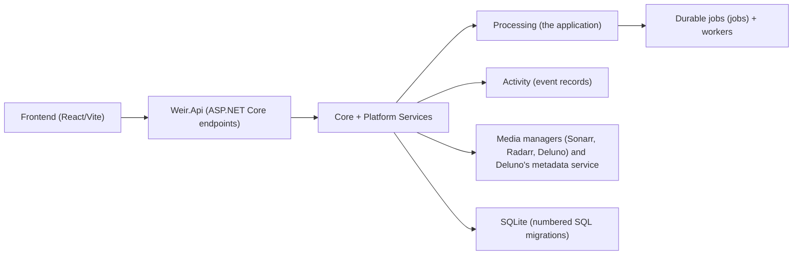
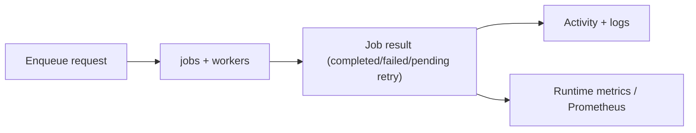

# Weir Architecture

This is the top-level map for agents and contributors. Deeper decisions live in [`docs/adr/`](docs/adr/).

## Product Shape

Weir is a self-hosted media operations app:

- **Processing** remuxes watched media into cleaner outputs. It is configured as any number
  of **workflows** — each a row carrying its own paths, admission rules, schedule,
  guardrails and media manager connections — rather than one fixed movie scope and one
  fixed TV scope. The API and database still call a workflow a "library"; Settings calls it a
  workflow because in Deluno, Radarr and Sonarr a library is where media ends up. A workflow's
  `media_type` (Movies or TV; named `media_scope` until #460)
  is a property of the workflow, not what the module partitions on. It still decides the
  cleanup shape, which manager queue is asked when a workflow links none, and which workflow a
  job belongs to when its payload names none. A hand-off from a manager lands in the workflow
  whose watched folder holds the file. Adding a workflow is a POST. See
  [ADR-0014](docs/adr/ADR-0014-processing-libraries-replace-fixed-scopes.md). The singleton
  settings rows that workflows replaced were dropped in `0025`, and the scope-shaped
  `path-settings` and `remux-rules-settings` routes that outlived them were removed in #460.
- **Media managers** are the products Weir accepts work from and reports back to.
  A connection carries a *kind* (Radarr, Sonarr, Deluno, or anything posting Weir's
  own payload) rather than each product having its own routes and columns; every inbound
  event arrives at `POST /api/v1/intake/webhook/{source}`. See
  [ADR-0013](docs/adr/ADR-0013-media-managers-are-kinds-not-products.md).
  Outbound, a media scope resolves to **every** connection that looks after it and each
  one is asked what it is importing and which files it still keeps. "Could not ask" is a
  distinct answer from "nothing is importing", and only the latter clears a delete. See
  [ADR-0015](docs/adr/ADR-0015-media-manager-port-outbound.md).
- **Library mode** cleans files already imported into a library, replacing each one in place with
  its cleaned copy through the crash-safe swap described in the
  [file lifecycle contract](docs/file-lifecycle-contract.md).
- The app's pages are **Processing** (the first screen: every file Weir is working on now),
  **Activity**, **Library**, **Settings** and **System**. System holds updates, backups, security
  and logs.

## Runtime Shape

- Server: C# / .NET 10 under `apps/server` (ASP.NET Core minimal APIs, SQLite through
  `Microsoft.Data.Sqlite` with explicit SQL and numbered SQL migrations). See
  [ADR-0017](docs/adr/ADR-0017-backend-on-dotnet.md).
- Frontend: React + Vite under `apps/web/src`, served by the server from `WEIR_WEB_DIST`.
- Packaging: a Docker image (linux/amd64 and linux/arm64) and a Windows Velopack installer whose
  .NET tray app (`apps/tray`) starts and watches the server, and stops it by setting a named Windows event
  the server listens for (`Local\Weir-Stop-<pid>`), killing it only if it does not exit in time. Both carry ffmpeg and mkvmerge
  (MKVToolNix) — the Docker image installs them from Debian packages, the Windows package vendors
  checksum-verified builds. See [`THIRD_PARTY_NOTICES.md`](THIRD_PARTY_NOTICES.md).
- Runtime data: `WEIR_HOME`.

## Repository map

| Folder | What it is for |
| --- | --- |
| `apps/server` | The .NET 10 server: API, SQLite, durable jobs, the remux pass. Builds `Weir` / `Weir.exe`. |
| `apps/web` | The React and TypeScript web app the server serves, with its dev simulator and the committed OpenAPI contract. |
| `apps/tray` | The Windows tray app that starts and watches the server. |
| `docker` | The container entrypoint and the Docker deployment guide; the `Dockerfile` and `compose.yaml` are at the root. |
| `packaging` | Windows installer build (Velopack) and brand assets. |
| `docs` | Contracts, ADRs, release notes, runbooks and the agent documentation map; the index is [`docs/README.md`](docs/README.md). |
| `docs-site` | The public documentation website (Docusaurus). |
| `scripts` | Repository tooling, CI gates and release checks; see [`scripts/README.md`](scripts/README.md). |
| `.github` | CI and release workflows, issue and pull request templates. |
| `.githooks` | The pre-push hook that runs the local checks. |

## Server Map

Solution `apps/server/Weir.slnx`; details in [`apps/server/README.md`](apps/server/README.md).

- `src/Weir.Host`: the process — configuration, logging, database startup, Kestrel, Windows Service and systemd support. Builds `Weir` / `Weir.exe`.
- `src/Weir.Api`: endpoints and HTTP behaviour — auth and CSRF, security headers, request ids, the OpenAPI document, serving the web app.
- `src/Weir.Infrastructure`: SQLite (connections, stores, numbered migrations in `Migrations/`), the durable job queue and workers, the remux pass, the remux writers (ffmpeg/ffprobe and the mkvmerge writer added in #548), media manager clients, the filesystem and log files.
- `src/Weir.Core`: records and rules with no IO — the Processing rules engine, job rules, media manager rules, settings and security primitives.
- `tests/*`: xUnit tests per project. Two of the projects judge a running server from outside, as a process over HTTP and never in-process: `Weir.Contract.Tests` (the contract suite, one test class per area under `Activity/`, `Auth/`, ...; `Weir.Contract.FakeTools` is its fake ffprobe/ffmpeg) and `Weir.E2E.Tests` (Playwright for .NET, the browser smoke).
- `tools/Weir.LiveAudit`: the packaged live audit, a Playwright for .NET walk through every screen of an installed Weir (the Docker image or the Windows package); CI and the release workflow run it.
- `apps/tray/Weir.Tray`: the Windows tray app shipped in the installer.

## Frontend Map

- `src/app`: app-level router and providers.
- `src/layouts`: shell/navigation layout.
- `src/pages`: feature pages (Dashboard, Activity, Library, Setup, System), plus sign-in and setup.
- `src/lib`: API clients, query hooks, typed data helpers, and UI helpers.
- `src/components`: reusable UI and brand components.
- `src/styles`: design tokens and shell styling.
- `src/test`: frontend test setup.

## Boundary Rules

- Processing code should keep destructive or irreversible behavior behind explicit services and tests.
- Backend APIs should expose typed schemas at boundaries instead of inferred shapes.
- Frontend pages should use typed API/query helpers from `src/lib` rather than ad hoc fetch calls.
- Cross-cutting runtime concerns belong in shared services (`Weir.Core` rules, `Weir.Infrastructure` platform services), not inside Processing implementation details.
- `Weir.Core` stays free of IO; filesystem, database, process and HTTP work lives in `Weir.Infrastructure` behind seams tests can replace.
- File lifecycle changes must preserve the safety contract in [`docs/file-lifecycle-contract.md`](docs/file-lifecycle-contract.md).

## Live Data

Every screen follows Weir from one server-sent event stream, `GET /api/v1/activity/stream`, shared by the whole web app. A new number arrives by a push, never by a timer or a Refresh button.

- **Publish:** a component that changes data calls `DataChangePublisher.Publish(DataTopics.<Topic>)` in `Weir.Infrastructure.Activity` once the change has committed (`uow.OnCommitted`). Each open stream sends a `data.changed` frame, `{ "topic": "<snake_case_name>" }`.
- **Consume:** `LIVE_TOPIC_QUERIES` in `apps/web/src/lib/live/live-topics.ts` says which queries each topic reads again. A screen adds its query keys to its topic and drops its `refetchInterval`.
- **Not from the database:** data that changes outside a commit has a publisher of its own. `TrayHandOffWatcher` watches the files the Windows tray writes in the data folder (`update-state.json`, `update-settings.json`, `lan-access`) and publishes `update` and `network_access` when one is written, by the tray or by the server. `UpdateOutlook` publishes `update` when a release check finds something new, and `MetricsChangeTask` publishes `metrics` at most every five seconds while a stream is open. After "Restart to apply" the page needs no check of its own: the stream reconnects and the new `boot_id` reads every query again.
- **Connection:** `server.hello` opens every stream with `{ "boot_id" }`, new on each server start. While the connection is lost the shell shows "Live updates paused", and when it is back every query is read again; a different `boot_id` after a reconnect also reloads the page if the server now serves a newer build.

## Job Lifecycle

## Architecture Decision Records

Current ADR index: [`docs/adr/README.md`](docs/adr/README.md).

Add an ADR when a decision changes runtime storage, data safety, security boundaries, release mechanics, or packaging behavior.
