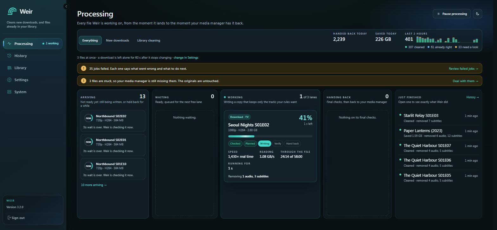
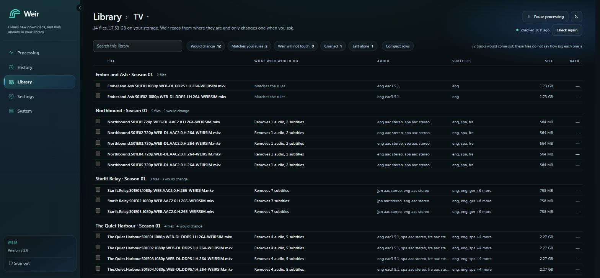

<p align="center">
  <picture>
    <source media="(prefers-color-scheme: dark)" srcset="packaging/brand/weir-mark.svg">
    
  </picture>
</p>

<h1 align="center">Weir</h1>

<p align="center">
  <b>Keep the audio and subtitle tracks you want. Drop the rest.</b><br>
  A self-hosted app that cleans up your movie and TV files: new downloads, and the library you already have.
</p>

<p align="center">
  <a href="https://github.com/jampat000/Weir/releases/latest"></a>
  <a href="https://github.com/jampat000/Weir/pkgs/container/weir"></a>
  <a href="LICENSE"></a>
</p>

<p align="center">
  <a href="#install-with-docker">Docker</a> ·
  <a href="#install-on-windows">Windows</a> ·
  <a href="#first-steps">First steps</a> ·
  <a href="https://jampat000.github.io/Weir/">Documentation</a>
</p>

<!-- README_LOCKED_SECTION_START: project-note -->
## A note on this project

Weir is a vibe-coded project.

I built it because I wanted a media workflow that matched the way I actually manage my library, and I could not find an existing tool that fit. I am not a software engineer and can't code and I have the upmost respect for the people that can.  So this started from a very practical place: solve the problems I kept running into and keep refining it until it worked the way I needed.

It is opinionated on purpose. Every module exists because it solved a real problem in my own setup first.

If it happens to fit the way you manage your library too, use it, improve it, and share those improvements under the same open license.

<!-- README_LOCKED_SECTION_END: project-note -->

## What Weir does

Movie and TV files often come with a dozen audio tracks and subtitles in languages you'll never use.
Weir removes them, so every file ends up with just the tracks you chose.

- **You set the rules once.** For example: keep English and Japanese audio, keep English subtitles, drop commentary.
- **New downloads are cleaned automatically.** Weir watches a folder, cleans each file that lands there, and puts the result in an output folder.
- **Your existing library can be cleaned too.** Weir scans it, shows you what it would remove and how much space that saves, and only removes anything once you confirm.
- **It never re-encodes.** Tracks are copied as they are, so there's no quality loss and it's fast.
- **Nothing is lost if something goes wrong.** Weir works on a copy and only replaces a file once the new one checks out.

Everything Weir needs comes with it, including ffmpeg and MKVToolNix. There's nothing else to install.

## Screenshots

| Home | Activity |
| --- | --- |
|  |  |

| Processing | Library |
| --- | --- |
|  |  |

| Settings | A processed file |
| --- | --- |
|  |  |

| Light mode | On your phone |
| --- | --- |
|  |  |

## Install with Docker

Weir runs on any machine with Docker, including Synology, Unraid, TrueNAS and Raspberry Pi. Both
64-bit Intel/AMD and ARM are supported.

### The quickest way

Make a folder, save this as `compose.yaml` inside it:

```yaml
services:
  weir:
    image: ghcr.io/jampat000/weir:latest
    container_name: weir
    ports:
      - "9347:9347"
    volumes:
      - ./weir-data:/data/weir
    restart: unless-stopped
```

Then run:

```bash
docker compose up -d
```

Open **http://your-server-ip:9347** and create your account. That's it.

`./weir-data` holds Weir's database, settings, logs and backups. Keep it and you keep everything.

### With your media folders

Weir can only clean files it can see, so give it your media folders. This is the setup most people want:

```yaml
services:
  weir:
    image: ghcr.io/jampat000/weir:latest
    container_name: weir
    ports:
      - "9347:9347"
    environment:
      - WEIR_PUID=1000   # the user that owns your media folders
      - WEIR_PGID=1000   # that user's group
    volumes:
      - ./weir-data:/data/weir
      - /srv/media:/media
    restart: unless-stopped
```

- **`/srv/media`** is where your media lives on the host. Change it to your own path.
- **`/media`** is where Weir sees it. Use `/media/...` paths when you set up folders in Weir.
- **`WEIR_PUID` / `WEIR_PGID`** make Weir read and write files as that user, so it can move them. Run `id your-username` on the host to find the numbers. On Synology it's usually `1026` / `100`, on Unraid `99` / `100`.

### Alongside Sonarr, Radarr and a download client

If Weir works next to other apps, **give every container the same folders at the same paths**.
When one app tells another where a file is, that path has to mean the same thing in both.

```yaml
services:
  weir:
    image: ghcr.io/jampat000/weir:latest
    container_name: weir
    ports:
      - "9347:9347"
    environment:
      - WEIR_PUID=1000
      - WEIR_PGID=1000
    volumes:
      - ./weir-data:/data/weir
      - /srv/media:/media
    restart: unless-stopped

  sonarr:
    image: lscr.io/linuxserver/sonarr:latest
    environment:
      - PUID=1000
      - PGID=1000
    volumes:
      - ./sonarr-config:/config
      - /srv/media:/media        # same folder, same path as Weir
    ports:
      - "8989:8989"
    restart: unless-stopped

  qbittorrent:
    image: lscr.io/linuxserver/qbittorrent:latest
    environment:
      - PUID=1000
      - PGID=1000
    volumes:
      - ./qbittorrent-config:/config
      - /srv/media:/media        # same folder, same path again
    ports:
      - "8080:8080"
    restart: unless-stopped
```

A folder layout that works well:

```text
/srv/media
├── downloads/complete/movies   ← your download client finishes files here   (Weir's watched folder)
├── downloads/complete/tv
├── weir/movies                 ← Weir puts cleaned files here               (Weir's output folder)
├── weir/tv
├── movies                      ← your library
└── tv
```

### Common changes

| I want to… | Do this |
| --- | --- |
| Use a different port | Change the left number: `"8080:9347"` puts Weir at `http://your-server-ip:8080` |
| Pin a version instead of `latest` | `image: ghcr.io/jampat000/weir:3.1.0` |
| Use HTTPS through a reverse proxy | Set `WEIR_SESSION_COOKIE_SECURE=true` and `WEIR_TRUSTED_PROXY_IPS=<your proxy's IP>`. See [the reverse proxy guide](docs-site/docs/deployment/reverse-proxy.md) |
| Protect saved API keys with their own secret | Set `WEIR_CREDENTIALS_SECRET` to a long random value (`openssl rand -hex 32`) **before** you add Sonarr or Radarr |
| Use a GPU | See [hardware acceleration](docker/README.md#hardware-acceleration-and-device-passthrough). It's optional; Weir doesn't re-encode, so you usually don't need it |

You don't need an `.env` file or any secrets to get started. Weir creates its own session secret
on first start and keeps it in `weir-data`.

Every Docker option is in [docker/README.md](docker/README.md).

## Install on Windows

1. Download **`Weir-win-Setup.exe`** from the [latest release](https://github.com/jampat000/Weir/releases/latest).
2. Run it. You don't need admin rights.
3. Weir asks which port to use the first time it starts. Keep **9347** unless something else uses it.
4. Your browser opens Weir. Create your account.

Weir lives in the system tray, next to the clock. Right-click the icon to open Weir, open its data
folder, change the port, check for updates or quit.

- Weir is installed to `%LocalAppData%\Weir`. Your data (database, logs, backups) is kept in `C:\ProgramData\Weir`.
- Weir runs as you, not as a Windows service, so it can reach your mapped network drives and NAS shares.
- Installing without a screen (a script, or remotely)? Pass the port: `Weir-win-Setup.exe -- --port 9347`.

More in the [Windows guide](docs-site/docs/deployment/windows.md).

## First steps

1. **Create your account.** The first time you open Weir, it asks for a username and password. This is the admin account.
2. **Follow the setup wizard.** Pick your time zone, then give Weir two folders for Movies and two for TV:
   - **Watched folder**: where your downloads finish. Weir cleans whatever lands here.
   - **Output folder**: where Weir puts each cleaned file.

   You can skip the wizard and do this later on the **Processing** page.
3. **Choose what to keep.** On **Processing**, set each library's audio and subtitle languages.
4. **Try it.** Put a file in a watched folder. Weir usually notices within seconds. On network shares
   and in Docker it can take up to five minutes, because Weir falls back to checking on a timer.
   The file shows up on **Home** while it's being worked on, and in **Activity** once it's done.

To clean a library you already have, open **Processing → Library**, pick the library and press
**Scan now**. Weir shows you what it would remove and how much space that frees before it changes
anything.

### Connecting other apps

Under **Settings → Media managers** you can connect:

- **Deluno** hands each file to Weir, waits for it to be cleaned, then imports it. This is the fully automatic setup.
- **Sonarr and Radarr** import the cleaned files from Weir's output folder. Weir also checks their
  queue before it touches a file, and they power **Download again** for titles that lost tracks after
  you changed your rules. See [Sonarr and Radarr](#sonarr-and-radarr) below.
- **Anything else** can hand files to Weir by posting to `/api/v1/intake/webhook/native`. The [API reference](docs-site/docs/api/index.md) links the full specification.

### Sonarr and Radarr

Your download client finishes into Weir's watched folder, Weir writes the cleaned copy to its output
folder, and Sonarr or Radarr import from there. You connect them with a **remote path mapping**: it
tells Sonarr "when the download client says a file is in the downloads folder, look in Weir's output
folder instead." Sonarr then only ever sees cleaned files.

1. **In Weir**, open **Processing → Libraries** and edit the library.
   - **Watched folder**: where your download client finishes files, e.g. `/media/downloads/complete/tv`
   - **Output folder**: where Weir puts cleaned files, e.g. `/media/weir/tv`
   - Using torrents? Turn **After cleaning, remove the original download** off, so the torrent keeps
     seeding. Your download client or Sonarr removes it later, as they normally would.
2. **Connect Sonarr** under **Settings → Media managers**, with its address and API key
   (Sonarr: **Settings → General → API Key**).
3. Back in the library, the **Media manager** section shows the exact mapping to add, with copy buttons.
4. **In Sonarr**, go to **Settings → Download Clients → Remote Path Mappings** and press **+**:
   - **Host**: exactly what's in your download client's **Host** field on that same screen, e.g. `qbittorrent`
   - **Remote Path**: Weir's watched folder, e.g. `/media/downloads/complete/tv/`
   - **Local Path**: Weir's output folder, e.g. `/media/weir/tv/`

   The output folder has to exist before Sonarr will save the mapping.
5. Keep **Completed Download Handling** switched on in Sonarr. This setup relies on it.
6. Back in Weir, press **Check again** in the library's **Media manager** section. It reads Sonarr's
   settings (it never changes them) and shows ✓, or tells you exactly what to fix.

Radarr works the same way, with its own movies folders. After a download finishes, Sonarr shows
"No files found are eligible for import" until Weir is done with it. That's normal: it checks again
every minute and imports the cleaned file as soon as it appears.

## Updating

- **Docker:** `docker compose pull && docker compose up -d`. Your data carries over.
- **Windows:** right-click the tray icon and choose **Check for updates**, or go to **Settings → Upgrade** in Weir.

Weir updates its database itself when it starts. Before a big upgrade, it's worth taking a backup
in **Settings → Backup and restore**.

What changed in each version: [release notes](https://github.com/jampat000/Weir/releases).

## Something not working?

| Problem | Try this |
| --- | --- |
| Files sit in the watched folder and nothing happens | Check the path in Weir is the path **inside the container** (`/media/...`, not `/srv/media/...`). In Docker, Weir may take up to five minutes to notice a file. |
| "Permission denied" in Activity | Set `WEIR_PUID` / `WEIR_PGID` to the user that owns your media folders |
| Can't open Weir | Check the container is running (`docker ps`) and you're using the right port. Weir's health check is at `http://your-server-ip:9347/health` |
| Logged out after every restart | You're setting `WEIR_SESSION_SECRET` to a different value each time. Remove it and let Weir manage it |

Still stuck? [Open an issue](https://github.com/jampat000/Weir/issues). Include what you expected,
what happened, and the lines from **Settings → Logs**.

## Documentation

- [Documentation site](https://jampat000.github.io/Weir/): installing, reverse proxies, security, the API
- [Docker reference](docker/README.md): every variable, GPUs, file ownership, network shares
- [Release notes](https://github.com/jampat000/Weir/releases)

## Building from source

For developers. You need the .NET 10 SDK and Node.js 24.

```bash
git clone https://github.com/jampat000/Weir.git
cd Weir/apps/web
npm ci
npm run dev
```

This starts the server and the web app together at `http://localhost:8782/`. See
[local development](docs/local-development.md), [contributing](CONTRIBUTING.md) and
[how releases are made](docs/release.md).

## Support Weir

Weir is free. If it saves you time, the best ways to help are to star the repository, report bugs
you find, and share improvements.

## License

Weir is licensed under the [GNU Affero General Public License v3.0 or later](LICENSE).
You can use, study, change and share it. If you share a changed version, or run one as a service
for others, you have to make its source available under the same license.
