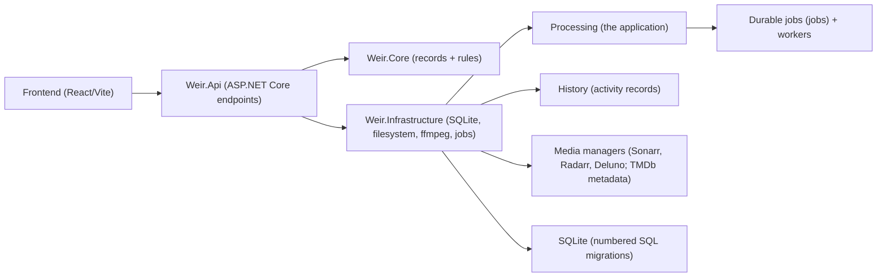
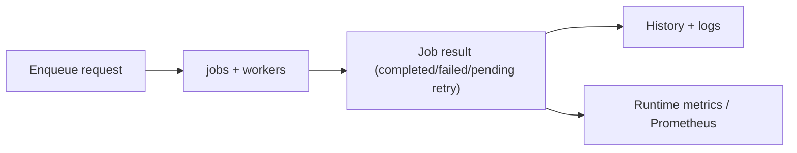

# Architecture Overview

Weir is a self-hosted media processing stage: it cleans new downloads, and files already in your
library. Processing is the application — it remuxes media into cleaner outputs, either as files
arrive in a library's watched folder or as a pass over a library you already have. mkvmerge writes
Matroska and ffmpeg writes everything else, and each library can be set to use ffmpeg for
everything instead. Around it, the platform provides history, logs, backups, updates and
security. The first screen, **Processing**, shows every file Weir is working on right now, from
the moment it arrives until its media manager has it back. **History**, **Library**, **Settings**
and **System** sit beside it.

## Runtime shape

## Technology stack

| Layer | Technology |
|-------|-----------|
| Backend | C# / .NET 10, ASP.NET Core minimal APIs, SQLite via Microsoft.Data.Sqlite with numbered SQL migrations |
| Frontend | React 19 / Vite / TailwindCSS / TanStack Query |
| Tray app | C# / .NET 9 WinForms tray |
| Installer | Velopack |
| Packaging | Docker (linux/amd64 + linux/arm64) + Windows installer, both carrying ffmpeg and mkvmerge (MKVToolNix) |

## Server map

The server lives in `apps/server` (solution `Weir.slnx`).

| Project | Responsibility |
|---------|---------------|
| `src/Weir.Host` | The process itself: startup, configuration from `WEIR_*` variables, builds `Weir` / `Weir.exe` |
| `src/Weir.Api` | HTTP endpoints under `/api/v1`, request and response behaviour, OpenAPI document, serving the web app |
| `src/Weir.Infrastructure` | SQLite access with explicit SQL, numbered SQL migrations in `Migrations/`, filesystem work, the ffmpeg and mkvmerge process runners, durable jobs and workers |
| `src/Weir.Core` | Records and rules only — no disk, network or database access |
| `tests/` | xUnit tests for each project |

The server records its schema revision in the `alembic_version` table, a name kept from the
earlier Python backend, so older databases still open. The numbered SQL migrations in
`Weir.Infrastructure/Migrations` are the only source of schema changes. On start, a database at an
earlier revision is upgraded in place, in one transaction; a database from a newer release is
refused and left unchanged.

## Frontend map

| Directory | Responsibility |
|-----------|---------------|
| `src/app` | App-level router and providers |
| `src/layouts` | Shell/navigation layout |
| `src/pages` | Feature pages (Processing, History, Library, Settings, System), plus sign-in and setup |
| `src/lib` | API clients, query hooks, typed data helpers |
| `src/components` | Reusable UI and brand components |

## Job lifecycle

New files are noticed two ways, and both end at the same job.

- **Straight away.** Each enabled library with a watched folder and "watch for changes" turned on gets
  its own recursive filesystem watcher. Events are debounced (`WEIR_PROCESSING_WATCHER_DEBOUNCE_SECONDS`,
  3 seconds by default) and then queue the ordinary watched-folder scan. Creating, editing or deleting a
  library takes effect without a restart, and if the operating system reports lost events the library is
  scanned in full and its watcher replaced. `WEIR_PROCESSING_WATCHER_ENABLED=0` turns the watchers off.
- **As a backstop.** Every library is scanned on its own timer anyway (`scan_interval_seconds`, five
  minutes by default), so a folder a watcher cannot see — a network share, a container mount that does
  not forward events — still gets picked up.

The watcher decides nothing about a file itself: extension checks, exclusions, size limits, the hold
timer and settling all stay in the scan handler that already owns them.

## Deployment model

Weir supports a single-instance deployment:

- One application process
- One host or container
- One SQLite database writer
- Same-origin web app and API by default

Horizontal scaling is not supported. Worker counts control in-process job slots within the single process.

## Boundary rules

- Processing code keeps destructive behavior behind explicit services and tests
- Server APIs expose typed contracts at boundaries, described in the committed OpenAPI document
- Frontend pages use typed API/query helpers from `src/lib`
- Rules with no side effects belong in `Weir.Core`; anything that touches disk, database or processes belongs in `Weir.Infrastructure`
- File lifecycle changes must preserve the [safety contract](https://github.com/jampat000/Weir/blob/main/docs/file-lifecycle-contract.md)
